# PN532 NFC Reader

Web interface for PN532 NFC reader using libnfc.

## Requirements

- Python 3.10+
- libnfc (`brew install libnfc`)
- PN532 board connected via USB-UART

## Usage

```bash
# Start server
./start.sh

# Stop server
./stop.sh
```

Open http://localhost:5001 in browser.

## Features

- Scan NFC cards (ISO14443A)
- Display UID, ATQA, SAK, ATS
- Auto-scan on page load
- Communication log with parsed PN532 frame display
- CSV export for communication logs
- Type 4 tag emulation with NDEF content

## PN532 Frame Format

All communication with the PN532 uses the Normal Information Frame format:

| Field | Bytes | Description |
|-------|-------|-------------|
| Preamble | `00` | 1 byte sync |
| Start Code | `00 FF` | 2 bytes frame start marker |
| LEN | 1 byte | Number of bytes in data field (TFI + PD0..PDn) |
| LCS | 1 byte | Length checksum: Lower byte of [LEN + LCS] = 0x00 |
| TFI | `D4` or `D5` | Frame identifier: `D4` = Host→PN532, `D5` = PN532→Host |
| CMD | 1 byte | Command code (PD0, first byte of DATA) |
| Params | LEN-2 bytes | Command parameters (PD1..PDn) |
| DCS | 1 byte | Data checksum: Lower byte of [TFI + PD0 + ... + PDn + DCS] = 0x00 |
| Postamble | `00` | 1 byte frame end |

### Special Frames

- **ACK**: `00 00 FF 00 FF 00` — Acknowledgement
- **NACK**: `00 00 FF FF 00 00` — Negative acknowledgement
- **Wakeup Preamble**: Series of `55` bytes sent to wake the PN532 from sleep

### Common Command Codes

Commands are sent with TFI=`D4`. Responses use TFI=`D5` with response code = command code + 1.

| Code | Command | Description |
|------|---------|-------------|
| `0x00` | Diagnose | Self-diagnostic test |
| `0x02` | GetFirmwareVersion | Read firmware version |
| `0x06` | ReadRegister | Read register value |
| `0x08` | WriteRegister | Write register value |
| `0x12` | SetParameters | Set internal parameters |
| `0x14` | SAMConfiguration | Configure SAM (Security Access Module) |
| `0x16` | PowerDown | Enter power-down mode |
| `0x32` | RFConfiguration | Configure RF communication |
| `0x42` | InCommunicateThru | Transparent data exchange with target |
| `0x44` | InRelease | Release target |
| `0x4A` | InListPassiveTarget | Detect and list passive targets |
| `0x52` | InDeselect | Deselect target |

## Example: NFC Scan Communication Analysis

A complete libnfc-driven PN532 NFC card scan flow (348 lines of communication records).

### Sequence Diagram

```mermaid
sequenceDiagram
    participant Host as Host (libnfc)
    participant PN532
    participant Card as NFC Card

    rect rgb(40, 40, 80)
    Note over Host, PN532: 1. Initialization
    Host->>PN532: Wakeup Preamble (55 55 00 ...)
    Host->>PN532: SAMConfiguration (0x14) mode=Normal
    PN532-->>Host: ACK + Response OK
    Host->>PN532: Diagnose (0x00) "libnfc"
    PN532-->>Host: ACK + Echo "libnfc"
    Host->>PN532: GetFirmwareVersion (0x02)
    PN532-->>Host: ACK + v1.6 (IC=PN532, ISO14443A/B+ISO18092)
    Host->>PN532: SetParameters (0x12) 0x14
    PN532-->>Host: ACK + Response OK
    end

    rect rgb(40, 60, 40)
    Note over Host, PN532: 2. RF Configuration
    Host->>PN532: ReadRegister (0x06) CIU regs ×5
    PN532-->>Host: ACK + Register values
    Host->>PN532: WriteRegister (0x08) TxMode/RxMode=0x80
    PN532-->>Host: ACK + Response OK
    Host->>PN532: RFConfiguration (0x32) RF field OFF
    PN532-->>Host: ACK + Response OK
    Host->>PN532: RFConfiguration (0x32) RF field ON
    PN532-->>Host: ACK + Response OK
    Host->>PN532: RFConfiguration (0x32) MaxRetries=FF FF FF
    PN532-->>Host: ACK + Response OK
    Host->>PN532: ReadRegister + WriteRegister (fine-tune CIU)
    PN532-->>Host: ACK + Response OK
    Host->>PN532: RFConfiguration (0x32) MaxRetries=00 01 02
    PN532-->>Host: ACK + Response OK
    end

    rect rgb(60, 40, 20)
    Note over Host, Card: 3. Card Polling — ISO 14443A
    Host->>PN532: InListPassiveTarget (0x4A) BrTy=0x00 (106kbps Type A)
    PN532->>Card: REQA / WUPA
    Card-->>PN532: ATQA=00 02, SAK=20, UID=7B 9A DC E3
    PN532-->>Host: ACK + 1 target found (ATQA+SAK+UID+ATS)
    Note right of Card: Card detected!<br/>ATS: 05 78 80 B8 02
    Host->>PN532: InRelease (0x44) target 0
    PN532-->>Host: ACK + Response OK
    end

    rect rgb(50, 50, 50)
    Note over Host, Card: 4. Continue Polling Other Protocols
    Host->>PN532: InListPassiveTarget BrTy=0x00 (ISO14443A retry)
    PN532-->>Host: ACK + 0 targets
    Host->>PN532: InListPassiveTarget BrTy=0x01 (FeliCa 212)
    PN532-->>Host: ACK + 0 targets
    Host->>PN532: InListPassiveTarget BrTy=0x02 (FeliCa 424)
    PN532-->>Host: ACK + 0 targets
    Host->>PN532: InListPassiveTarget BrTy=0x03 (ISO14443B)
    PN532-->>Host: ACK + 0 targets
    end

    rect rgb(50, 30, 50)
    Note over Host, Card: 5. Low-Level Protocol Probing
    Host->>PN532: WriteRegister CIU regs (ISO14443B mode)
    Host->>PN532: InCommunicateThru (0x42) various probes
    PN532-->>Host: Timeout (no response)
    Host->>PN532: WriteRegister CIU regs (ISO15693/NFC-V mode)
    Host->>PN532: InCommunicateThru (0x42) various probes
    PN532-->>Host: Timeout (no response)
    end

    rect rgb(40, 40, 60)
    Note over Host, PN532: 6. Cleanup & Power Down
    Host->>PN532: InListPassiveTarget BrTy=0x04 (Jewel/Topaz)
    PN532-->>Host: ACK + 0 targets
    Host->>PN532: RFConfiguration (0x32) RF field OFF
    PN532-->>Host: ACK + Response OK
    Host->>PN532: InDeselect (0x52) all targets
    PN532-->>Host: ACK + Response OK
    Host->>PN532: RFConfiguration (0x32) RF field OFF
    PN532-->>Host: ACK + Response OK
    Host->>PN532: PowerDown (0x16) WakeUp=0xF0
    PN532-->>Host: ACK + Response OK
    end
```



### 1. Initialization Phase

| Step | Command | Description |
|------|---------|-------------|
| Wakeup | `55 55 00 ...` | Preamble to wake up PN532 |
| SAMConfiguration (`0x14`) | Parameter: `01` (Normal mode) | No SAM, direct mode |
| Diagnose (`0x00`) | Sends `libnfc` string | Communication loopback test, PN532 echoes back `libnfc` confirming normal communication |
| GetFirmwareVersion (`0x02`) | Returns `32 01 06 07` | **PN532, v1.6**, supports ISO14443A/B + ISO18092 |
| SetParameters (`0x12`) | Parameter: `0x14` | Enable automatic ATR_RES and RATS |

### 2. RF Field Configuration and Register Setup

- **ReadRegister / WriteRegister**: Configure CIU analog front-end registers (TxMode, RxMode, TxControl, etc.)
- **RFConfiguration (item 0x01)**: RF field off (`0x00`) then on (`0x01`), resetting the RF field
- **RFConfiguration (item 0x05)**: Set MaxRetries = `FF FF FF` (infinite retries), preparing for polling
- Reconfigure registers `0x6305=0x40`, `0x633C=0x10` to adjust analog front-end parameters
- Reset MaxRetries = `00 01 02` (fast polling mode)

### 3. Multi-Protocol Card Polling

#### ISO 14443-4 Type A (106 kbps) — Card Found

**InListPassiveTarget** (`0x4A`, BrTy=`0x00`) — successfully found 1 card:

| Field | Value | Meaning |
|-------|-------|---------|
| **ATQA** | `00 02` | ISO 14443A response |
| **SAK** | `0x20` | **ISO 14443-4 compatible** (supports ISO-DEP) |
| **UID** | `7B 9A DC E3` | 4-byte UID |
| **ATS** | `05 78 80 B8 02` | See breakdown below |

**ATS Breakdown:**
- `TL=05`: ATS length 5 bytes
- `T0=78`: FSCI=8 (max frame 256 bytes), TA1/TB1/TC1 all present
- `TA1=80`: Only supports 106 kbps bidirectional
- `TB1=B8`: FWI=11 (frame waiting time ~620ms), SFGI=8 (~77ms)
- `TC1=02`: Supports CID, does not support NAD

**Card Type Inference**: SAK=`0x20` + 4-byte random UID + above ATS parameters, highly consistent with contactless smart card characteristics (such as EMV contactless payment card, MIFARE Plus SL3, or JCOP card).

#### Release Then Continue Polling Other Protocols

Card was released via **InRelease** (`0x44`), then tried sequentially:

| Protocol | BrTy | Result |
|----------|------|--------|
| ISO 14443A 106kbps (retry) | `0x00` | Not found |
| FeliCa 212 kbps | `0x01` | Not found |
| FeliCa 424 kbps | `0x02` | Not found |
| ISO 14443B 106kbps | `0x03` | Not found |

### 4. Low-Level Protocol Probing

libnfc uses direct CIU register manipulation + **InCommunicateThru** (`0x42`) for lower-level protocol probing:

- **Group 1** (registers = `0x83 0x83`, ISO14443B frame format):
  - Send `01 0b 3f 80` — Timeout
  - Send `06 00` — Timeout
  - Send `10` — Timeout

- **Group 2** (reconfigure 10 CIU registers for other protocols, possibly ISO 15693/NFC-V):
  - Send `0a` — Timeout
  - Send `0c` — Timeout

All timed out, indicating no cards of other protocol types in the field.

### 5. Final Polling and Cleanup

| Step | Command | Result |
|------|---------|--------|
| InListPassiveTarget (Jewel/Topaz, BrTy=`0x04`) | `0x4A` | Not found |
| RFConfiguration (RF field off) | `0x32 01 00` | RF field off |
| ReadRegister → InCommunicateThru (empty) | Empty data | Success (cleanup) |
| InRelease | `0x52 00` | Release all targets |
| RFConfiguration (RF field off) | `0x32 01 00` | RF field off again |
| **PowerDown** (`0x16`) | WakeUp=`0xF0` | PN532 enters low-power sleep |

### Scan Summary

| Item | Information |
|------|-------------|
| **Reader** | PN532 v1.6 (libnfc driver) |
| **Scan Protocols** | ISO14443A, ISO14443B, FeliCa 212/424, Jewel/Topaz, low-level protocol probing |
| **Card Found** | 1 ISO 14443-4 Type A card |
| **UID** | `7B:9A:DC:E3` |
| **SAK** | `0x20` (ISO 14443-4 compatible, not MIFARE Classic) |
| **Max Frame Length** | 256 bytes |
| **Communication Speed** | 106 kbps |
| **Likely Card Type** | EMV contactless payment card / MIFARE Plus SL3 / JCOP smart card |
